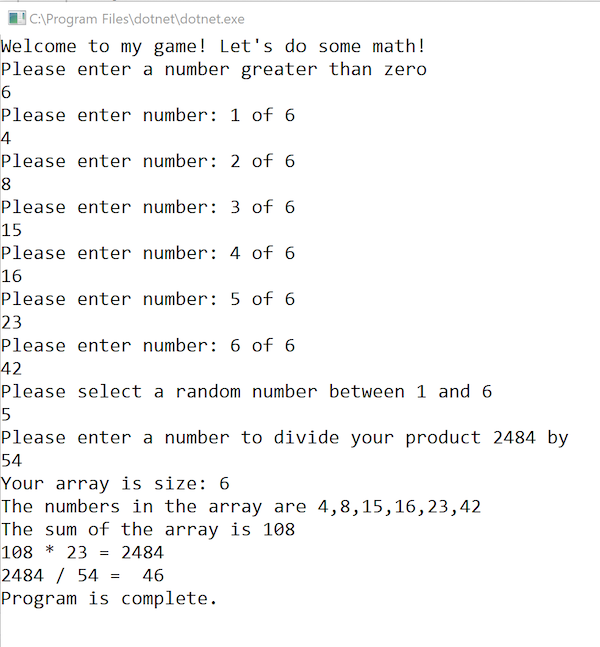

# Numbers Game

## The Problem Domain

Within a new **.NET Core console** application, follow the instructions below to create a math game that takes user input, manipulates data, and utilizes error handling, by following the given specifications.

---

**Program Specifications:**

Your solution should include the following Methods:

- [**Main**](Methods/Main.md)
- [**StartSequence**](Methods/StartSequence.md)
- [**Populate**](Methods/Populate.md)
- [**GetSum**](Methods/GetSum.md)
- [**GetProduct**](Methods/GetProduct.md)
- [**GetQuotient**](Methods/GetQuotient.md)

---

### Example

---
